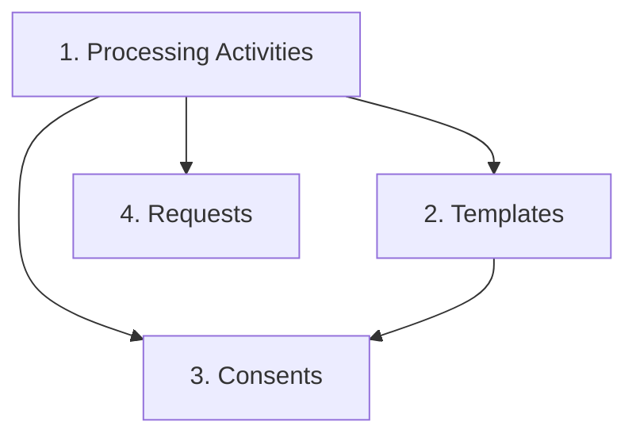

# Odoo to Flask Migration Workspace

This repository is dedicated to the migration process from a legacy Odoo instance to a modern Flask application. It follows a modular ETL (Extract, Transform, Load) architecture.

## 📂 Project Structure & Code Files

- **`main.py`**: The CLI orchestrator. Wires together extraction, transformation, and loading into unified commands structured around entity groups (`processing-activity`, `template`, `consent`, `request`).
- **`config/.env.example`**: Template for environment variables (Odoo JWT tokens, Session IDs, Flask API keys).
- **`docs/mapping.md`**: Official documentation of field-by-field and enum value mappings from Odoo to Flask.
- **`agents.md`**: Memory Context Protocol file used to track agent tasks, architectural decisions, and bug fixes across sessions.

### ETL Scripts (`scripts/`)
- **`scripts/extract/extract_odoo.py`**: Handles HTTP requests to Odoo's custom APIs. Manages dual authentication (JWT + Session Cookie), pagination, and saves raw data to CSV/JSON.
- **`scripts/transform/transform_processing_activity.py`**: Contains the transformation logic for Processing Activities. Performs depth-first flattening on hierarchical trees.
- **`scripts/transform/transform_template.py`**: Contains the transformation logic for Notice Templates, mapping languages and template types to Flask enums.
- **`scripts/transform/transform_consent.py`**: Contains the transformation logic for Consents (`dpcmData`). Safely parses nested arrays, maps Odoo's legacy statuses/types to strict Flask Enums, and splits data into deemed and live records.
- **`scripts/transform/transform_request.py`**: Contains the transformation logic for Data Subject Requests/Grievances (`dpgrData`). Aligns Odoo's statuses with Flask's initiation tracking.
- **`scripts/load/load_flask.py`**: Reads the processed CSVs and loads data into the Flask API. Handles parent-child resolution, email fallback generation, and split consent routing (Excel upload vs JSON POST).

> [!NOTE]
> Running the scripts under `scripts/` directly with Python will result in no output. They are modular libraries designed to be imported and executed by the CLI orchestrator `main.py`.

---

## 🚀 Getting Started

1. **Install Dependencies**:
   Ensure you use the virtual environment where dependencies are installed:
   ```bash
   pip install -r requirements.txt
   ```

2. **Configure Environments**:
   Copy `config/.env.example` to `config/.env` and fill in your actual tokens.

3. **Navigate to the Migration Folder**:
   Always run the CLI commands from the `migration/` directory so that config files and data directories resolve correctly:
   ```bash
   cd migration
   ```

---

## ⚠️ Migration Dependency Order (CRITICAL)

Because Consents and Requests reference Processing Activities and Templates, you **MUST** run the migration in the following dependency order:



1. **Processing Activities** (Master Data)
2. **Templates** (Master Data)
3. **Consents** (DPCM)
4. **Requests** (DPGR)

---

## 💻 CLI Commands

### Method 1: Run Full Pipelines (All Stages Together)
This will automatically extract from Odoo, transform the data, and load it into the Flask API.

```bash
# 1. Migrate Processing Activities
python main.py processing-activity run-all

# 2. Migrate Templates
python main.py template run-all

# 3. Migrate Consents
python main.py consent run-all

# 4. Migrate Requests
python main.py request run-all
```

### Method 2: Run Stage-by-Stage (Granular)
Use these subcommands if you want to inspect or modify the data manually between stages.

#### Stage 1: Extract from Odoo
Downloads raw data from Odoo APIs into `data/raw/`.
```bash
python main.py processing-activity extract
python main.py template extract
python main.py consent extract
python main.py request extract
```

#### Stage 1.5: Transform Data
Maps Odoo schemas to Flask-compliant structures under `data/processed/`.
```bash
python main.py processing-activity transform
python main.py template transform
python main.py consent transform
python main.py request transform
```

#### Stage 2: Load into Flask
Validates and uploads the processed data to the destination Flask API.
```bash
# Loads parent-child hierarchy topologically
python main.py processing-activity load

# Loads notice templates
python main.py template load

# Automatically splits and loads Consents to /import (deemed) and /live-consent (live)
python main.py consent load

# Loads Requests to /request/create
python main.py request load
```