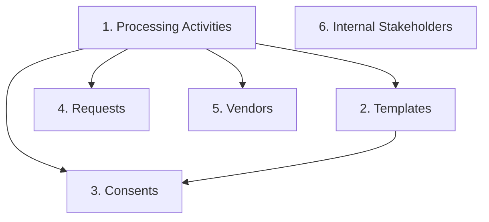

# Odoo to Flask Migration Workspace

This repository is dedicated to the migration process from a legacy Odoo instance to a modern Flask application. It follows a modular ETL (Extract, Transform, Load) architecture.

## 📂 Project Structure & Code Files

- **`main.py`**: The CLI orchestrator. Wires together extraction, transformation, and loading into unified commands structured around entity groups (`processing-activity`, `template`, `consent`, `request`).
- **`config/.env.example`**: Template for environment variables (Odoo JWT tokens, Session IDs, Flask API keys).
- **`docs/mapping.md`**: Official documentation of field-by-field and enum value mappings from Odoo to Flask.
- **`agents.md`**: Memory Context Protocol file used to track agent tasks, architectural decisions, and bug fixes across sessions.

### ETL Scripts (`scripts/`)
- **`scripts/extract/extract_odoo.py`**: Handles HTTP requests to Odoo's custom APIs. Manages dual authentication (JWT + Session Cookie), pagination, and saves raw data to CSV/JSON.
- **`scripts/transform/transform_processing_activity.py`**: Contains the transformation logic for Processing Activities. Performs depth-first flattening on hierarchical trees.
- **`scripts/transform/transform_template.py`**: Contains the transformation logic for Notice Templates, mapping languages and template types to Flask enums.
- **`scripts/transform/transform_consent.py`**: Contains the transformation logic for Consents (`dpcmData`). Safely parses nested arrays, maps Odoo's legacy statuses/types to strict Flask Enums, and splits data into deemed and live records.
- **`scripts/transform/transform_request.py`**: Contains the transformation logic for Data Subject Requests/Grievances (`dpgrData`). Aligns Odoo's statuses with Flask's initiation tracking.
- **`scripts/transform/transform_vendor.py`**: Contains the transformation logic for Vendors (`/vendors_details`). Maps risk/VRA states to Flask enums and decodes inline Base64 documents (NDA/VRA) into sidecar files + a manifest (see *Attachment Migration* below).
- **`scripts/transform/transform_stakeholder.py`**: Contains the transformation logic for Internal Stakeholders (`/stakeholders`). Maps `login`→email, coerces `phone: false`→`''`, and flattens `role_ids[]` to a deduped list of role **names** (Odoo role ids are dropped — they don't match Flask).
- **`scripts/load/stakeholder_role_mapper.py`**: Resolves Odoo role **names** → Flask role **ids** by fetching the live Flask role catalogue (`GET /roles/details`). Supports an optional alias file (`data/stakeholder_role_aliases.json`) to bridge naming differences. No role ids are ever hardcoded.
- **`scripts/load/stakeholder_report.py`**: Emits a `[SUCCESS]/[SKIPPED]/[FAILED]` audit block per stakeholder and writes a CSV/JSON summary to `data/processed/report_processed_stakeholders.*`.
- **`scripts/load/load_flask.py`**: Reads the processed CSVs and loads data into the Flask API. Handles parent-child resolution, email fallback generation, split consent routing (Excel upload vs JSON POST), re-encoding vendor attachment sidecars, and the email-free stakeholder load (role-name mapping + idempotent `/migration/stakeholder`).

> [!NOTE]
> Running the scripts under `scripts/` directly with Python will result in no output. They are modular libraries designed to be imported and executed by the CLI orchestrator `main.py`.

---

## 🚀 Getting Started

1. **Install Dependencies**:
   Ensure you use the virtual environment where dependencies are installed:
   ```bash
   pip install -r requirements.txt
   ```

2. **Configure Environments**:
   Copy `config/.env.example` to `config/.env` and fill in your actual tokens.

3. **Navigate to the Migration Folder**:
   Always run the CLI commands from the `migration/` directory so that config files and data directories resolve correctly:
   ```bash
   cd migration
   ```

---

## ⚠️ Migration Dependency Order (CRITICAL)

Because Consents and Requests reference Processing Activities and Templates, you **MUST** run the migration in the following dependency order:



1. **Processing Activities** (Master Data)
2. **Templates** (Master Data)
3. **Consents** (DPCM)
4. **Requests** (DPGR)
5. **Vendors** (DPTPA) — reference Processing Activities (departments) only.
6. **Internal Stakeholders** — independent (no PA/template dependency). Only
   requires that the Flask roles the Odoo names map to already exist (see
   *Internal Stakeholders* below). Can run any time.

---

## ▶️ Recommended End-to-End Sequence

Run from the `migration/` directory, in this order. Each `run-all` does
extract → transform → load for that entity.

```bash
cd migration

# Master data first (Consents/Requests depend on these)
python main.py processing-activity run-all   # 1. Processing Activities
python main.py template run-all              # 2. Templates (load + approve)

# Transactional data (reference PAs + templates)
python main.py consent run-all               # 3. Consents  (DPCM)
python main.py request run-all               # 4. Requests  (DPGR)

# Independent entities (no PA/template dependency)
python main.py vendor run-all                # 5. Vendors   (+ NDA/VRA docs)

# Internal Stakeholders — ensure target Flask roles (or an alias file) exist FIRST
python main.py stakeholder run-all           # 6. Internal Stakeholders (email-free)
```

> [!NOTE]
> Steps 1–2 are prerequisites for 3–4. Steps 5 and 6 are independent and may run
> any time. All loads are idempotent — re-running skips already-migrated records.

---

## 💻 CLI Commands

### Method 1: Run Full Pipelines (All Stages Together)
This will automatically extract from Odoo, transform the data, and load it into the Flask API.

```bash
# 1. Migrate Processing Activities
python main.py processing-activity run-all

# 2. Migrate Templates
python main.py template run-all

# 3. Migrate Consents
python main.py consent run-all

# 4. Migrate Requests
python main.py request run-all

# 5. Migrate Vendors (incl. NDA/VRA documents)
python main.py vendor run-all

# 6. Migrate Internal Stakeholders (email-free; roles mapped by name)
python main.py stakeholder run-all
```

### Method 2: Run Stage-by-Stage (Granular)
Use these subcommands if you want to inspect or modify the data manually between stages.

#### Stage 1: Extract from Odoo
Downloads raw data from Odoo APIs into `data/raw/`.
```bash
python main.py processing-activity extract
python main.py template extract
python main.py consent extract
python main.py request extract
python main.py vendor extract
python main.py stakeholder extract
```

#### Stage 1.5: Transform Data
Maps Odoo schemas to Flask-compliant structures under `data/processed/`.
```bash
python main.py processing-activity transform
python main.py template transform
python main.py consent transform
python main.py request transform
python main.py vendor transform
python main.py stakeholder transform
```

#### Stage 2: Load into Flask
Validates and uploads the processed data to the destination Flask API.
```bash
# Loads parent-child hierarchy topologically
python main.py processing-activity load

# Loads notice templates
python main.py template load

# Automatically splits and loads Consents to /import (deemed) and /live-consent (live)
python main.py consent load

# Loads Requests to /request/create
python main.py request load

# Loads Vendors (+ NDA/VRA documents) to /migration/vendor
python main.py vendor load

# Loads Internal Stakeholders to /migration/stakeholder (email-free, idempotent)
python main.py stakeholder load
```

---

## 👤 Internal Stakeholders

Migrates Odoo internal stakeholders (`GET /api/stakeholders`) into Flask as
Backend PA-Manager users.

**Email-free by design.** The loader targets the migration-extension endpoint
`POST /api/migration/stakeholder`, **not** the public `/api/stakeholder/create`.
The public route sends a welcome/credential email and requires SMTP; a
historical backfill must never email real users. The migration endpoint creates
the user with no outbound communication (no email/SMTP/OTP/notification/Celery),
sets a password hash + reset token (DB only), and is idempotent via the
migration source-map (re-runs return HTTP 409 → skipped).

**Roles are mapped by name, never by id.** Odoo and Flask assign different ids to
the same role, and one Odoo name can carry several ids (e.g. `DPO` = 4, 5, 9), so
`transform_stakeholder.py` keeps only deduped role **names** and the loader
resolves them against the live Flask catalogue (`GET /api/roles/details`).

> [!IMPORTANT]
> If an Odoo role name has no exact match in Flask, that stakeholder **fails**
> (logged) and the run continues. Bridge naming gaps with an alias file at
> `data/stakeholder_role_aliases.json` (override path via
> `STAKEHOLDER_ROLE_ALIAS_FILE`):
>
> ```json
> { "DPO": "Full Access", "PA Manager": "Full Access" }
> ```
>
> ⚠️ Aliasing to `Full Access` grants admin permissions to every migrated user.
> Prefer creating real `DPO` / `PA Manager` roles in Flask, then alias to those.

Per-stakeholder outcome (`CREATED` / `UPDATED` / `SKIPPED` / `FAILED`) is logged
and summarised in `data/processed/report_processed_stakeholders.{csv,json}`.

See `docs/stakeholder_migration.md` for the full field mapping, side-effect
trace, and edge cases.

---

## 📎 Attachment Migration

Vendor documents (and, later, request attachments) arrive from Odoo as **inline Base64** in the API response — not as downloadable URLs. Each attachment field is an object:

```json
"nda_attachment": { "fileName": "nda.pdf", "fileContent": "<base64>" }
```

Empty fields arrive as `{}` and are skipped. The pipeline never embeds Base64 in the CSV:

```text
extract (inline Base64)
  → transform_vendor: decode → data/attachments/vendor/<odoo_id>/<field>__<name>
                      + data/processed/vendor_attachments_manifest.json   (CSV stays clean)
  → load_flask: re-encode sidecar → payload["attachments"]
  → POST /migration/vendor: decode → upload_file() → Vendor path columns
```

**Field → column mapping:**

| Odoo field       | Flask column   |
| ---------------- | -------------- |
| `nda_attachment` | `nda_document` |
| `vra_attachment` | `dpa_document` |

Decoding/upload is centralized server-side in `dpdp_python/migration_ext/attachments/` (decoder, validators, mapper, uploader). Files are stored through the backend's existing `upload_file()` service under `uploads/vendors/`, so a migrated document is indistinguishable from one uploaded via the UI (same naming, download routes, and authorization). MIME is detected from the byte signature, falling back to the filename extension.