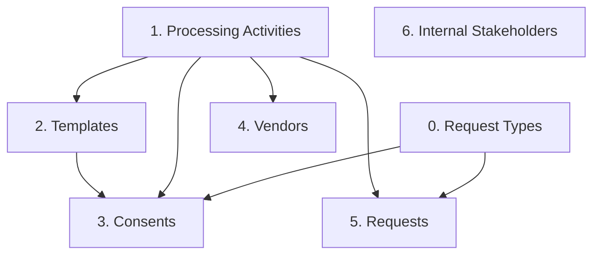

# Odoo to Flask Migration Workspace

This repository is dedicated to the migration process from a legacy Odoo instance to a modern Flask application. It follows a modular ETL (Extract, Transform, Load) architecture.

## 📂 Project Structure & Code Files

- **`main.py`**: The CLI orchestrator. Wires together extraction, transformation, and loading into unified commands structured around entity groups (`processing-activity`, `template`, `consent`, `request`).
- **`config/.env.example`**: Template for environment variables (Odoo JWT tokens, Session IDs, Flask API keys).
- **`docs/mapping.md`**: Official documentation of field-by-field and enum value mappings from Odoo to Flask.
- **`agents.md`**: Memory Context Protocol file used to track agent tasks, architectural decisions, and bug fixes across sessions.

### ETL Scripts (`scripts/`)
- **`scripts/extract/extract_odoo.py`**: Handles HTTP requests to Odoo's custom APIs. Manages dual authentication (JWT + Session Cookie), pagination, and saves raw data to CSV/JSON.
- **`scripts/transform/transform_processing_activity.py`**: Contains the transformation logic for Processing Activities. Performs depth-first flattening on hierarchical trees.
- **`scripts/transform/transform_template.py`**: Contains the transformation logic for Notice Templates, mapping languages and template types to Flask enums.
- **`scripts/transform/transform_consent.py`**: Contains the transformation logic for Consents (`dpcmData`). Safely parses nested arrays, maps Odoo's legacy statuses/types to strict Flask Enums, and splits data into deemed and live records.
- **`scripts/transform/transform_request.py`**: Contains the transformation logic for Data Subject Requests/Grievances (`dpgrData`). Aligns Odoo's statuses with Flask's initiation tracking, and (from the `/dpgr/id` enrichment) carries the real internal allottee (`assignToDM`) and the vendor handling the request (`assignToVendor`) — see *Vendor ↔ Request Activity* below.
- **`scripts/transform/transform_vendor.py`**: Contains the transformation logic for Vendors (`/vendors_details`). Maps risk/VRA states to Flask enums and decodes inline Base64 documents (NDA/VRA) into sidecar files + a manifest (see *Attachment Migration* below).
- **`scripts/transform/transform_stakeholder.py`**: Contains the transformation logic for Internal Stakeholders (`/stakeholders`). Maps `login`→email, coerces `phone: false`→`''`, and flattens `role_ids[]` to a deduped list of role **names** (Odoo role ids are dropped — they don't match Flask).
- **`scripts/load/stakeholder_role_mapper.py`**: Resolves Odoo role **names** → Flask role **ids** by fetching the live Flask role catalogue (`GET /roles/details`). Supports an optional alias file (`data/stakeholder_role_aliases.json`) to bridge naming differences. No role ids are ever hardcoded.
- **`scripts/load/stakeholder_report.py`**: Emits a `[SUCCESS]/[SKIPPED]/[FAILED]` audit block per stakeholder and writes a CSV/JSON summary to `data/processed/report_processed_stakeholders.*`.
- **`scripts/load/load_flask.py`**: Reads the processed CSVs and loads data into the Flask API. Handles parent-child resolution, email fallback generation, split consent routing (Excel upload vs JSON POST), re-encoding vendor attachment sidecars, and the email-free stakeholder load (role-name mapping + idempotent `/migration/stakeholder`).

> [!NOTE]
> Running the scripts under `scripts/` directly with Python will result in no output. They are modular libraries designed to be imported and executed by the CLI orchestrator `main.py`.

---

## 🚀 Getting Started

1. **Install Dependencies**:
   Ensure you use the virtual environment where dependencies are installed:
   ```bash
   pip install -r requirements.txt
   ```

2. **Configure Environments**:
   Copy `config/.env.example` to `config/.env` and fill in your actual tokens.

3. **Navigate to the Migration Folder**:
   Always run the CLI commands from the `migration/` directory so that config files and data directories resolve correctly:
   ```bash
   cd migration
   ```

---

## ⚠️ Migration Dependency Order (CRITICAL)

Because Consents and Requests reference Processing Activities and Templates, you **MUST** run the migration in the following dependency order:



0. **Request Types** (Master Data) — must exist before Consents and Requests so
   each record resolves its `request_type_id` by name. Pulled live from Odoo
   `/request-types`; loaded idempotently to Flask `/request-types/create` (see
   *Request Types* below).
1. **Processing Activities** (Master Data)
2. **Templates** (Master Data)
3. **Consents** (DPCM)
4. **Vendors** (DPTPA) — reference Processing Activities (departments) only.
5. **Requests** (DPGR) — depend on Vendors when a request carries an
   `assignToVendor` link: the vendor's contact user must already exist in Flask
   for the name match to resolve (see *Vendor ↔ Request Activity* below). Run
   Vendors **before** Requests.
6. **Internal Stakeholders** — independent (no PA/template dependency). Only
   requires that the Flask roles the Odoo names map to already exist (see
   *Internal Stakeholders* below). Can run any time.

> [!IMPORTANT]
> Before any load, the target tenant must be **provisioned** with active
> licenses (DPCM for consents, DPGR for requests) and the baseline request
> types. See *Prerequisites: DB Provisioning* below — a fresh/reset tenant has
> no license seats and consent/request loads fail with
> `400 No active license available`.

---

## ▶️ Recommended End-to-End Sequence

Run from the `migration/` directory, in this order. Each `run-all` does
extract → transform → load for that entity.

```bash
cd migration

# Master data first (Consents/Requests depend on these)
python main.py request-type run-all          # 0. Request Types (before consents+requests)
python main.py processing-activity run-all   # 1. Processing Activities
python main.py template run-all              # 2. Templates (load + approve)

# Transactional data (reference PAs + templates)
# Vendors BEFORE Requests — requests resolve their assignToVendor link by the
# vendor's contact-user name, so that user must already exist (see Vendor ↔ Request).
python main.py vendor run-all                # 3. Vendors   (+ NDA/VRA docs)

# Internal Stakeholders — ensure target Flask roles (or an alias file) exist FIRST
python main.py stakeholder run-all           # 4. Internal Stakeholders (email-free)
python main.py consent run-all               # 5. Consents  (DPCM)
python main.py request run-all               # 6. Requests  (DPGR, + vendor/allottee links)
```

> [!NOTE]
> Steps 1–2 are prerequisites for 3 and 5. Run **Vendors (4) before Requests (5)**
> so request→vendor links resolve. Stakeholders (6) are independent. All loads are
> idempotent — re-running skips already-migrated records and backfills links.

---

## 💻 CLI Commands

### Method 1: Run Full Pipelines (All Stages Together)
This will automatically extract from Odoo, transform the data, and load it into the Flask API.

```bash
# 0. Migrate Request Types (run before Consents + Requests)
python main.py request-type run-all

# 1. Migrate Processing Activities
python main.py processing-activity run-all

# 2. Migrate Templates
python main.py template run-all

# 3. Migrate Consents
python main.py consent run-all

# 4. Migrate Requests
python main.py request run-all

# 5. Migrate Vendors (incl. NDA/VRA documents)
python main.py vendor run-all

# 6. Migrate Internal Stakeholders (email-free; roles mapped by name)
python main.py stakeholder run-all
```

### Method 2: Run Stage-by-Stage (Granular)
Use these subcommands if you want to inspect or modify the data manually between stages.

#### Stage 1: Extract from Odoo
Downloads raw data from Odoo APIs into `data/raw/`.
```bash
python main.py request-type extract
python main.py processing-activity extract
python main.py template extract
python main.py consent extract
python main.py request extract
python main.py vendor extract
python main.py stakeholder extract
```

#### Stage 1.5: Transform Data
Maps Odoo schemas to Flask-compliant structures under `data/processed/`.
```bash
python main.py request-type transform
python main.py processing-activity transform
python main.py template transform
python main.py consent transform
python main.py request transform
python main.py vendor transform
python main.py stakeholder transform
```

#### Stage 2: Load into Flask
Validates and uploads the processed data to the destination Flask API.
```bash
# Loads request types (idempotent by name) — run before consents + requests
python main.py request-type load

# Loads parent-child hierarchy topologically
python main.py processing-activity load

# Loads notice templates
python main.py template load

# Automatically splits and loads Consents to /import (deemed) and /live-consent (live)
python main.py consent load

# Loads Requests to /request/create
python main.py request load

# Loads Vendors (+ NDA/VRA documents) to /migration/vendor
python main.py vendor load

# Loads Internal Stakeholders to /migration/stakeholder (email-free, idempotent)
python main.py stakeholder load
```

---

## 🏷️ Request Types

Migrates Odoo request types (`GET /api/request-types`) into Flask
(`POST /api/request-types/create`). **Run before Consents and Requests** so each
record resolves its `request_type_id` by name instead of falling back to a
hardcoded default.

```bash
python main.py request-type run-all     # extract → transform → load
# or stage-by-stage:
python main.py request-type extract     # → data/raw/raw_request_types.json
python main.py request-type transform   # → data/processed/processed_request_types.json
python main.py request-type load        # idempotent by name (skips existing)
```

**Field rename (Odoo → Flask):**

| Odoo | Flask |
| --- | --- |
| `sla_days` | `sla_expected_days` |
| `sla_amber_days` | `sla_amber_notification_days` |
| `sla_red_days` | `sla_red_notification_days` |
| `amber_days` | `amber_alert_days` |
| `red_days` | `red_alert_days` |
| `vendor_is_mandatory` | `vendor_mandatory` |
| `check_consent` | `consent_withdrawal_check` |
| `name`/`description`/`is_data_principal`/`nominee_access`/`is_revoke` | (same) |

Odoo-only fields (`id`, `request_type`, `is_nominee`, `company_id`,
`default_department_ids`, `is_active`) are dropped. `department` is always sent
empty — Odoo department ids don't map to Flask ids and the source carries no
names.

> [!IMPORTANT]
> **SLA defaults.** The backend rejects any SLA day at 0 and enforces
> `sla_expected_days > amber_alert_days > red_alert_days`,
> `amber_alert_days ≥ sla_amber_notification_days`,
> `red_alert_days ≥ sla_red_notification_days`. When the Odoo source set is
> missing/zero/out-of-order, the transform replaces **all five** with a valid
> default block: `45 / 30 / 15 / 15 / 7`. Valid source values pass through
> unchanged.
>
> **Single revoke type.** Flask allows only one request type with
> `is_revoke=true` per tenant. The transform keeps the first and demotes the
> rest to `false` (logged).

---

## 🗄️ Prerequisites: DB Provisioning (Licenses + Baseline Data)

A fresh or freshly-reset tenant has **no license seats**. `consume_license`
draws one seat per *new* data principal, so consent/request loads fail with
`400 No active license available for module 'DPCM'/'DPGR'`. Provision the target
tenant **before** loading (dev DB; adjust tenant id / creds as needed):

```bash
# Active DPCM (consents) + DPGR (requests) licenses for tenant 1, never expire.
PGPASSWORD=yashaswi123 psql -U yashaswi -h localhost -d privacium_db -c "
INSERT INTO licenses (license_type_id, tenant_id, total_users, used_users, expires_users, active, expires_at, created_at, updated_at)
SELECT lt.id, 1, 1000000, 0, 1000000, true, NULL, now(), now()
FROM license_types lt WHERE lt.code IN ('DPCM','DPGR')
  AND NOT EXISTS (SELECT 1 FROM licenses l WHERE l.tenant_id=1 AND l.license_type_id=lt.id);
"
```

License module codes: `DPGR, DPAP, DPCM, DPIA, DPTPA, DDMT`
(consents = DPCM, requests = DPGR). See `docs/db_reset_guide.md` for tenant
domain, API key, and baseline request-type provisioning.

---

## ♻️ Resetting Migrated Data (repeat testing)

`migration_ext.reset` (in the **backend** repo `dpdp_python/`) wipes everything
the pipeline creates back to a clean baseline, so the migration can be re-run
from scratch. Keeps seed/admin rows.

```bash
cd dpdp_python

# Dry run — prints what WOULD be deleted, changes nothing
./venv/bin/python -m migration_ext.reset

# Execute (single transaction; rolls back on any error)
./venv/bin/python -m migration_ext.reset --yes

# Also zero licenses.used_users + clear consumed_license_logs
./venv/bin/python -m migration_ext.reset --yes --reset-licenses

# Override keep ranges
./venv/bin/python -m migration_ext.reset --keep-users 1,2,3 --keep-pa-max 11 --keep-rt-max 11 --yes

# Reset ONE entity only (e.g. reload requests after a fix) — leaves the rest intact
./venv/bin/python -m migration_ext.reset --only requests --yes
./venv/bin/python -m migration_ext.reset --only consents,requests --yes
```

**`--only <entities>`** resets just the listed entities (comma list:
`consents, requests, request-types, vendors, processing-activities, users`) and
clears only their `migration_source_map` dedup rows — the rest of the DB is left
untouched. Cross-entity NO-ACTION refs are handled automatically (e.g.
`--only requests` nulls `consents.request_id` and clears request-linked
`vendor_activities` before deleting requests). Omit `--only` for a full reset.

> [!WARNING]
> Use the backend venv (`dpdp_python/venv/bin/python`) — a bare `python` lacks
> Flask/psycopg2 and the module won't import. `--yes` is destructive; it deletes
> consents, requests, vendors, migrated processing activities, migrated request
> types, Portal data principals, and the source-map. Dry-run first.

**Keeps by default:** users `1,2,3`; processing activities `1..11`. **Deletes:**
all consents/requests (+ children), vendors, `migration_source_map`, processing
activities outside the keep range, and **ALL request types** (so a re-migration
recreates the full set from Odoo). Pass `--keep-rt-max N` to preserve baseline
request types `1..N` instead.

| Flag | Default | Effect |
| --- | --- | --- |
| `--yes` | off (dry run) | actually execute the deletes |
| `--keep-users` | `1,2,3` | user ids to preserve |
| `--keep-pa-max` | `11` | keep processing activities id `1..N` |
| `--keep-rt-max` | `0` | keep request types id `1..N` (`0` = delete all) |
| `--reset-licenses` | off | clear `consumed_license_logs`, set `licenses.used_users=0` |

---

## 🔍 Reconciliation / Audit

Audit Odoo → Flask completeness per entity (source vs migrated ledger):

```bash
python main.py reconcile               # write report to data/processed/reconciliation_report.txt
python main.py reconcile --no-write    # print only, no file
python main.py reconcile --self-test   # internal consistency checks, then exit
python main.py reconcile --live        # verify against live Odoo + live Flask, surfaces DRIFT
```

`--live` reads Odoo + Flask tokens from `config/.env`.

---

## 👤 Internal Stakeholders

Migrates Odoo internal stakeholders (`GET /api/stakeholders`) into Flask as
Backend PA-Manager users.

**Email-free by design.** The loader targets the migration-extension endpoint
`POST /api/migration/stakeholder`, **not** the public `/api/stakeholder/create`.
The public route sends a welcome/credential email and requires SMTP; a
historical backfill must never email real users. The migration endpoint creates
the user with no outbound communication (no email/SMTP/OTP/notification/Celery),
sets a password hash + reset token (DB only), and is idempotent via the
migration source-map (re-runs return HTTP 409 → skipped).

**Roles are mapped by name, never by id.** Odoo and Flask assign different ids to
the same role, and one Odoo name can carry several ids (e.g. `DPO` = 4, 5, 9), so
`transform_stakeholder.py` keeps only deduped role **names** and the loader
resolves them against the live Flask catalogue (`GET /api/roles/details`).

> [!IMPORTANT]
> If an Odoo role name has no exact match in Flask, that stakeholder **fails**
> (logged) and the run continues. Bridge naming gaps with an alias file at
> `data/stakeholder_role_aliases.json` (override path via
> `STAKEHOLDER_ROLE_ALIAS_FILE`):
>
> ```json
> { "DPO": "Full Access", "PA Manager": "Full Access" }
> ```
>
> ⚠️ Aliasing to `Full Access` grants admin permissions to every migrated user.
> Prefer creating real `DPO` / `PA Manager` roles in Flask, then alias to those.

Per-stakeholder outcome (`CREATED` / `UPDATED` / `SKIPPED` / `FAILED`) is logged
and summarised in `data/processed/report_processed_stakeholders.{csv,json}`.

See `docs/stakeholder_migration.md` for the full field mapping, side-effect
trace, and edge cases.

---

## 🔗 Vendor ↔ Request Activity

Odoo's `/dpgr/dashboard` carries no assignment data. The request **enrichment**
pass (`GET /dpgr/id?id=<N>`, run automatically inside `request run-all`) pulls
three things the dashboard omits and the migration preserves:

| Odoo source (`/dpgr/id`) | Carried as | Lands in Flask |
| --- | --- | --- |
| `assignToVendor` `[{id, name}]` | `assigned_vendor_names` (+ `assigned_vendor_source_ids`) | `request_assigned_vendor` M2M **+** a `VendorActivity` row |
| `assignToDM` `[{id, name}]` | `assigned_user_names` → resolved to Flask user ids | `request.assigned_users` (the real internal allottee) |
| `trackAssigneeStatus` | `assignee_status`, `assignee_raised_on` | allotment state + when |

**Vendor resolution is name-based, server-side.** The loader ships
`assigned_vendor_names` as a JSON list; `POST /api/migration/request` resolves
each name by joining `Vendor → User` and matching `User.name` (case-insensitive,
tenant-scoped), then appends the M2M link and creates a `VendorActivity`
(`request_date` = Odoo `createOn`, not the migration run date). Names that don't
resolve are returned in the response as `unlinked_vendor_names` and logged — never
silently dropped. The Odoo contact id (`assigned_vendor_source_ids`) is shipped
too, available for id-based disambiguation if two vendors ever share a contact
name.

> [!IMPORTANT]
> **Run Vendors before Requests.** The vendor's contact user must exist in Flask
> for the name match to succeed, otherwise the request still migrates but its
> vendor link lands in `unlinked_vendor_names`. Re-running the request load after
> vendors are present backfills the links idempotently (M2M membership + an
> existing-`VendorActivity` check prevent duplicates).

> [!NOTE]
> Existing `data/raw/raw_requests.csv` extracts taken **before** this feature lack
> the `assignToVendor` / `assignToDM` columns. Re-run `request run-all` (or at
> least `request enrich → transform → load`) to populate them.

All timestamps are carried as full `YYYY-MM-DDTHH:MM:SS` (date **and**
time-of-day) end to end — `raised_on`/`action_date`/`assignee_raised_on` for
requests, and the equivalent datetime normalization across consents, vendors,
templates, and processing activities — so historical chronology is preserved, not
truncated to midnight.

The reconciliation report's **Vendor ↔ Request** section now counts source
`assignToVendor` links against live `request_assigned_vendor` rows (link rows are
expected, not anomalous).

---

## 📎 Attachment Migration

Vendor documents (and, later, request attachments) arrive from Odoo as **inline Base64** in the API response — not as downloadable URLs. Each attachment field is an object:

```json
"nda_attachment": { "fileName": "nda.pdf", "fileContent": "<base64>" }
```

Empty fields arrive as `{}` and are skipped. The pipeline never embeds Base64 in the CSV:

```text
extract (inline Base64)
  → transform_vendor: decode → data/attachments/vendor/<odoo_id>/<field>__<name>
                      + data/processed/vendor_attachments_manifest.json   (CSV stays clean)
  → load_flask: re-encode sidecar → payload["attachments"]
  → POST /migration/vendor: decode → upload_file() → Vendor path columns
```

**Field → column mapping:**

| Odoo field       | Flask column   |
| ---------------- | -------------- |
| `nda_attachment` | `nda_document` |
| `vra_attachment` | `dpa_document` |

Decoding/upload is centralized server-side in `dpdp_python/migration_ext/attachments/` (decoder, validators, mapper, uploader). Files are stored through the backend's existing `upload_file()` service under `uploads/vendors/`, so a migrated document is indistinguishable from one uploaded via the UI (same naming, download routes, and authorization). MIME is detected from the byte signature, falling back to the filename extension.

---

## 📊 Reconciliation Report

Proves *how much* data actually landed (and explains every record that did not),
instead of eyeballing `logs/migration.log`. Implemented in
`scripts/report/reconcile.py`; renders `data/processed/reconciliation_report.txt`.

Four count layers per entity:

| layer | read from | meaning |
| --- | --- | --- |
| **SOURCE** | `data/raw/*` (or live Odoo with `--live`) | what Odoo gave |
| **STAGED** | `data/processed/*` | what transform produced |
| **MIGRATED** | `migration_source_map` (live Postgres) | what actually landed in Flask |
| **FAILED** | `data/processed/errors_*.csv` | rejected rows + grouped reasons |

`MIGRATED` reads the ledger via `docker exec <pg> psql`. Container/creds are
overridable with `RECON_PG_CONTAINER` / `RECON_PG_USER` / `RECON_PG_DB`. Every
external read degrades to `n/a` rather than raising, so the report always renders.

### Commands

```bash
python main.py reconcile                 # full audit: print AND write the .txt
python main.py reconcile --no-write      # same audit, print only (no file)
python main.py reconcile --self-test     # check the tool itself; no DB, no report
python main.py reconcile --live          # also re-pull live Odoo + verify live Flask
```

| flag | runs | DB | network | writes file |
| --- | --- | --- | --- | --- |
| *(none)* | full audit, print **and** write `.txt` | yes | no | yes |
| `--no-write` | same audit, **print only** (pipe / CI) | yes | no | no |
| `--self-test` | **not an audit** — internal consistency checks (ledger identity, % bounds, render non-empty), exits 0/1 | no | no | no |
| `--live` | audit **+** re-pull Odoo SOURCE **+** confirm each migrated row exists in the live Flask app → **DRIFT** | yes | yes (both APIs) | yes |

Flags combine, e.g. `python main.py reconcile --live --no-write`.

### Live mode (`--live`)

The default audit trusts the `migration_source_map` ledger. `--live` is the only
mode that hits the network: it re-counts SOURCE from live Odoo and joins each
ledger `flask_id` against a live Flask `GET` list (`/consent/`, `/vendor/list`,
`/auth/backend-users`, `/processing/activities/simple`, `/notice-templates/`),
paging through every record (the list endpoints cap at 100/page). A record the
ledger claims migrated but the app no longer returns is flagged **DRIFT** (stale
ledger / row deleted post-load). Failed live reads render `n/a` — never counted
as success.

`--live` also runs a **field-level value-equality check** across *every* field:
for each migrated record it joins source (Odoo) ↔ dest (live Flask) via the
ledger and compares in three passes:

1. **Explicit maps** (`FIELD_MAPS`) for renamed / enum fields (e.g. Odoo
   `userActivityType` → Flask `processing_type`), with transform-aware
   normalization (case/spacing/enum aliases, dates, phone digits).
2. **Auto-pairing** — every remaining scalar field whose normalized name matches
   on both sides is value-checked generically.
3. **List fields** (audit logs / `history`, `managers`, attachment arrays) are
   **length-compared** (e.g. `history[len]: 5 != 3`); element-wise deep diff
   would need per-entity rules and is not done.

A field is flagged only when *both* sides carry a value (missing source field =
skipped, not a false mismatch). Crucially, each entity prints a **coverage
inventory**: total source fields, total dest fields, how many were value-checked,
and an explicit list of any **unchecked source fields** + **complex/list fields**
— so nothing is silently ignored. To close a gap, read the unchecked list and add
a `FIELD_MAPS` rule for that field.

### Entity tracking + template fan-out

All six entities are now source-map tracked. `processing_activity` and
`template` are recorded via a backend recorder endpoint, **POST
/migration/source-map**: the loader creates them through the existing native
routes, then posts the returned id(s) to the ledger. One Odoo template fans out
to many Flask notice/email rows, each recorded under the same `odoo_source_id`
with a distinct `sub_key`, so MIGRATED counts **distinct** source ids (not
emitted rows).

Tokens are read from `config/.env` (the same gitignored file the loaders use),
auto-loaded at import — nothing is exported to the global shell or hardcoded:

```ini
ODOO_JWT_TOKEN=<source Bearer>              # live Odoo (SOURCE)
FLASK_API_BASE_URL=http://localhost:<port> # dest container
FLASK_API_KEY=<dest Bearer>                # live Flask (MIGRATED)
FLASK_TENANT_DOMAIN=<tenant host>          # optional: only if dest needs a Host header
```

### Verdicts

```
+ PASS         migrated == source
+ PASS*        shortfall fully covered by accepted-loss
~ RECOVERABLE  remaining failures are operational (license/quota) → re-runnable
x GAP          records vanished unexplained → investigate
! DRIFT        ledger says landed, live app disagrees (--live only)
? UNTRACKED    no source-map ledger yet (processing_activity, template)
? UNKNOWN      a count could not be read
```

`data/accepted_loss.json` is the operator-maintained registry of records
intentionally not migrated; they offset the shortfall as **PASS\***.

> [!NOTE]
> A freshly-migrated `processing_activity` / `template` only leaves **UNTRACKED**
> once a load has run with the recorder wiring (it backfills the ledger for
> existing rows too). Re-run the load if their MIGRATED still reads `n/a`.

### Tests

```bash
venv/bin/python -m pytest tests/test_reconcile.py -q
```

DB-free: exercises counters, ledger accounting, verdicts (incl. DRIFT), and the
renderer against synthetic fixtures.